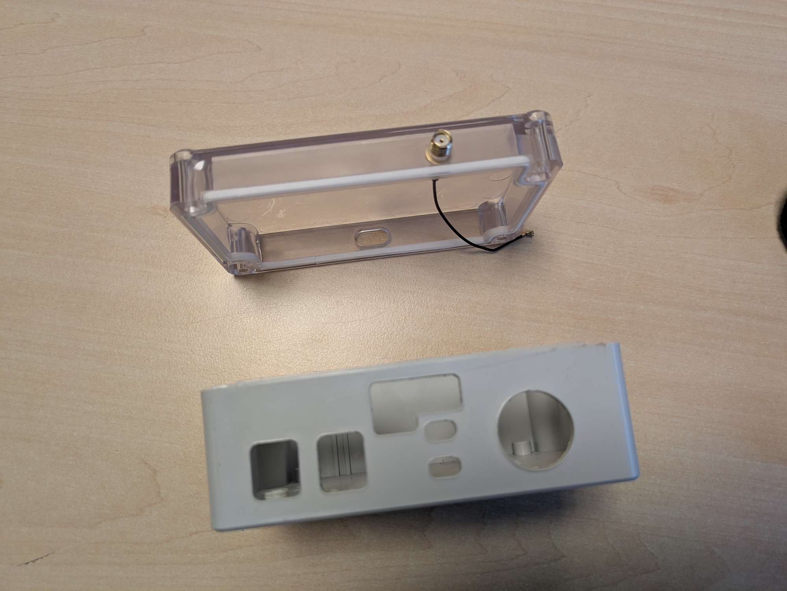

# MJLO-hardware
Meet je Leefomgeving | hardware

## Files and folders
- `pcb/` contains the Gerber .zip as generated by EasyEDA and the unpacked contents of this .zip file.
- `box/` contains the vector files to cut the necessary holes in the MJLO box. It also contains the 3D-printable carrier to insert into the box and carry the PCB, and the vector outline file that serves as basis for this insert and the PCB shape.

## At a glance

| Feature | Specification |
|--------|---------------|
| **Battery life** | 3–4 weeks (with 15-minute interval) |
| **Measurement interval** | Default 15 min; optional high-rate mode |
| **Wireless communication** | LoRaWAN (SX1262) via The Things Network |
| **GNSS** | UC6580 |
| **Microcontroller** | Heltec Wireless Tracker (ESP32-S3) |
| **Sensors included** | PM (SEN55), CO₂ (SCD41), TPH (BME280), UV (AS7331), light (TSL2591), microphone (SPH0645), accelerometer (LSM6DSR) |
| **Storage** | microSD slot for offline logging / backfill |
| **Display** | Waveshare 2.13" e-ink |
| **Sleep current** | ~17 μA base (plus sensor overhead) |
| **Battery** | 21700 Li-ion (~5000 mAh) |
| **Enclosure** | IP65 ABS box (118 × 78 × 55 mm) |
| **Approx. cost** | ~€180 / ~$210 per box (excl. shipping) |

## Parts list
With the exception of the PCB, all components in the box can be purchased off-the-shelf depending on where you live. As Steven is from the Netherlands, the purchase list will include both international and NL-local purchase links.

Neglecting shipping costs, the total hardware price is roughly $210 / €180. If you are building one or two boxes, the price per box can become a bit more expensive due to shipping.

- [Heltec Wireless Tracker](https://heltec.org/project/wireless-tracker/) ([NL](https://www.tinytronics.nl/en/development-boards/microcontroller-boards/with-gps/heltec-wireless-tracker-v1.1-esp32-s3-sx1262-lora-868mhz-gnss-with-0.96-inch-tft-display))
- [SEN55 PM sensor](https://www2.mouser.com/ProductDetail/Sensirion/SEN55-SDN-T?qs=MyNHzdoqoQLyWUzejWkZfg%3D%3D) ([NL](https://www.tinytronics.nl/nl/sensoren/lucht/vochtigheid/sensirion-sen55-sdn-t-omgevingssensor-fijnstof-luchtvochtigheid-temperatuur-voc-nox)) - _make sure to include the associated [cable](https://www2.mouser.com/ProductDetail/Sensirion/SEN5x-Jumper-6-pin-cable-set?qs=1Kr7Jg1SGW%252BR386X9%2FGSqw%3D%3D) ([NL](https://www.tinytronics.nl/en/cables-and-connectors/cables-and-adapters/jst-compatible/jst-ghr-06v-s-to-dupont-female-compatible-cable-6p-15cm))._
- [SCD41 CO2 sensor](https://www.aliexpress.com/item/1005007402021824.html) ([NL](https://www.tinytronics.nl/en/sensors/air/humidity/gy-scd41-module-co2-humidity-temperature-sensor-i2c)) - _be sure to select the SCD41, not the SCD40._
- [BME280 TPH sensor](https://www.aliexpress.com/item/1005006953448721.html) ([NL](https://www.tinytronics.nl/en/sensors/air/pressure/bme280-digital-barometer-pressure-and-humidity-sensor-module)) - _AliExpress pretty much only has clones._
- [AS7331 UV sensor](https://www.aliexpress.com/item/1005007944993656.html) ([NL](https://www.tinytronics.nl/en/sensors/optical/light-and-color/as7331-uv-light-sensor-module))
- [TSL2591 Light sensor](https://www.aliexpress.com/item/1005008721729329.html) ([NL](https://www.kiwi-electronics.com/nl/adafruit-tsl2591-high-dynamic-range-digital-light-sensor-stemma-qt-1636))
- [SPH0645 Microphone](https://www2.mouser.com/ProductDetail/Adafruit/3421?qs=AQlKX63v8RvZGoQRFfPrCQ%3D%3D) ([NL](https://www.digikey.nl/nl/products/detail/adafruit-industries-llc/3421/6691114))
- [LSM6DSR Accelerometer](https://moffshop.deyta.de/products/lsm6dsr)
- [Waveshare E-ink display](https://www.waveshare.com/pico-epaper-2.13.htm) ([NL](https://www.tinytronics.nl/en/displays/e-ink/waveshare-2.13-inch-e-ink-e-paper-display-for-raspberry-pi-pico))
- [MicroSD reader](https://www.aliexpress.com/item/1005005591145849.html) ([NL](https://www.bitsandparts.nl/SD-Card-Reader-Kaartlezer-breakout-board-module-SPI-Mini-p1929523)) - _The breakout board should come without the headers soldered._
- [Voltage regulator](https://labcrafter.co.uk/products/5v-boost-converter-with-true-shutdown)
- 21700 battery ([NL](https://www.tinytronics.nl/en/power/batteries/21700/samsung-21700-li-ion-battery-4900mah-9.8a-inr21700-50e)) - _No international link provided, since batteries should be purchased as close to home as possible. Try to find an unprotected ~5000mAh battery, such as the Samsung INR21700-50E._
- [21700 battery holder](https://www.aliexpress.com/item/1005005518599950.html) ([NL](https://www.tinytronics.nl/en/power/battery-holders-and-clips/21700/1x-21700-battery-holder-for-pcb))
- [Box](https://www.tme.eu/nl/en/details/z57jph-tm-abs/multipurpose-enclosures/kradex/z57jph-tm-abs/) ([NL](https://www.tinytronics.nl/en/tools-and-mounting/enclosures/universal/kradex-enclosure-118x78x55mm-ip65-grey-transparent-z57jph-tm-abs))
- [PCB](https://www.kroonos.tech/shop/meet-je-leefomgeving-pcb/)
- [Small components](https://www.kroonos.tech/shop/meet-je-leefomgeving-components/) - _To mount all boards and sensors to the PCB, you will need a bunch of headers, pins, buttons and some wires. You can purchase these at the same store as the PCB. If you want to gather these yourself, you can view the contents of the bundle at the store listing._

> [!TIP]
> The Heltec antenna provided with the Wireless Tracker is decent, but there are antennas with better performance, such as this one:  
> [RF Solutions ANT-8WIRE-SMA](https://www.rfsolutions.co.uk/antennas/antenna-flexi-wire-1-4-wave-868mhz-sma/)

## Preparing the box
To prepare the box, you will need a laser cutter and a 3D-printer. If you don't have these available, feel free to send an email to the Kroonos webshop (see the PCB), and we may be able to sell the printed and cut items there as well.

### Cutting the box
The box needs some holes cut for the antenna, accessing the buttons and charger and providing ventilation for the sensors. For the necessary files, see https://github.com/Ichthus-College-IN/MJLO-hardware. It is recommended you get an additional box which can be sacrificed to find the appropriate settings for your laser cutter. Be warned that a 10W laser may not cut through the plastic sufficiently; a 40W laser is recommended. Also: the fumes that are released during cutting are quite bad. Use good ventilation and consider wearing a face mask while you're working on this. Thanks to covid, everyone should have some masks around!

Two important notes about the `cutout` files (referencing colour codes that are present in the Adobe Illustrator files).
1. The black border is just used for alignment and should not be included in the laser path. Some laser programs can 'disable' a path from being sent to the printer but can use these for alignment purposes. Try to align the box so that the laser touches the border on all sides equally.
2. The red hole to the right of the USB charging port should be cut on the opposite side of the box (not the same side as the USB port). This is the mounting hole for the antenna, which should be pointing upwards.

> [!IMPORTANT]
> Alignment of the box is crucial, as the spacing on some of the holes is tight. Make sure that the box is perfectly centered horizontally, and aim the laser to hit the box 50/50 on the bottom. Aligning on the top is rather difficult due to the transparant plastic not resulting in clear lines.

### Printing the carrier
The PCB is screwed to a 3D-printed carrier, which can be slid neatly into the box, holding everything in place. This 3D print does not require much precision: any older printer will do, even with a 0.3mm layer thickness. Depending on the printer and settings, printing a carrier takes anywhere from 0h30m to 1h30m. The colour doesn't matter as this goes inside the box. Steven uses PLA without problems so far, but maybe for longevity, it can be better to use ABS.

### Mounting the antenna
The SMA side of the antenna adapter can be screwed into the top hole. This hole is very tight to prevent water leakage, and it can be rather fiddly to screw the adapter in. Using a spanner and your thumb is a decent option.

## The hardware
To assemble the PCB, refer to the images below. It shows where all headers and pins are located (on the top and bottom side). Please note that you cannot simply first solder everything to the top side and then the bottom, since you will not be able to solder everything in this case. Step-by-step building instructions are a work-in-progress. For reference, here are a picture from the top and bottom of the PCB for anyone interested:

After soldering all pins and headers, cut and strip some solid-core wires for four of the sensors:

Once all sensors are inserted, you can put the carrier into the box and put the PCB on top of it. As a result, your box should look like this:

## The software
The software is available at https://github.com/Ichthus-College-IN/MJLO-firmware.